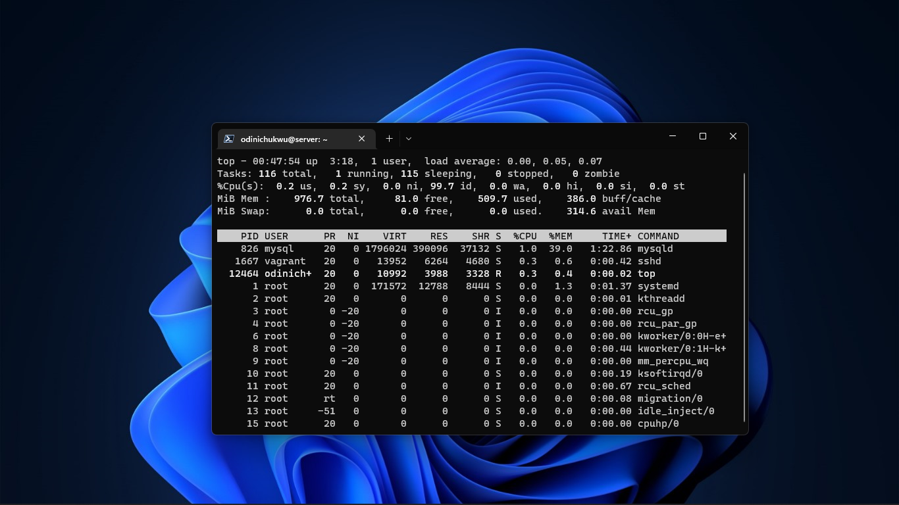
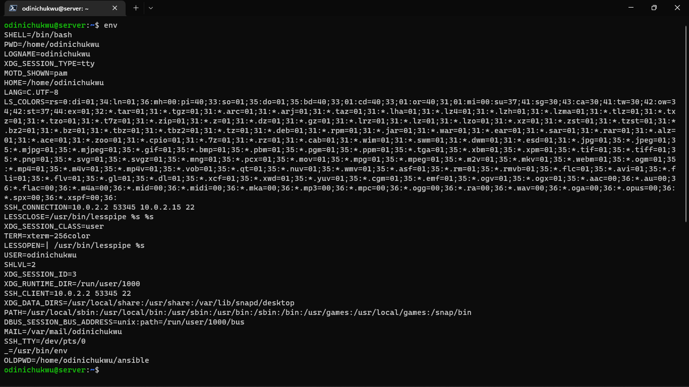

Exercise 2

Task: Research online for 10 more linux commands aside the ones already mentioned in this module. Submit using your altschool-cloud-exercises project, explaining what each command is used for with examples of how to use each and example screenshots of using each of them.

Instruction: Submit your work in a folder for this exercise in your altschool-cloud-exercises project. You will need to learn how to embed images in markdown files.

Solution:
  1. The command "ls-a" is used to list all the files and directories including hidden files in the current directory.

  2. The command "ls-l" is used to list all the files and directories in the current directory with their permissions, size, owner, group, date and time of last modification and name.

  3. The command "history" is used to list all the commands that have been executed in the current session.

  4. The command "dir" is used to list all the files and directories in the current directory.

  5. The command "ps" is used to list all the processes running on the system.

  6. The command "top" is used to list all the processes running on the system in a tree view.

  7. The command "free" is used to display the amount of free and used memory in the system.

  8. The command "env" is used to display all the environment variables.

  9. The command "timedatectl" is used to display the current date and time.

  10. The command "pwd" is used to display the current working directory.

