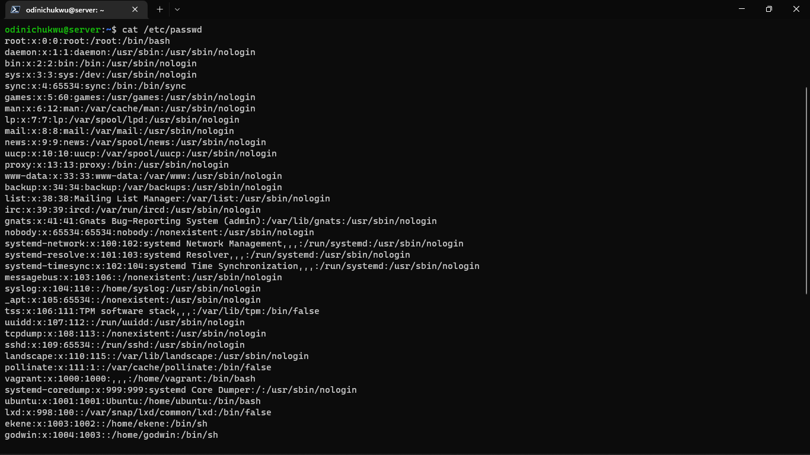
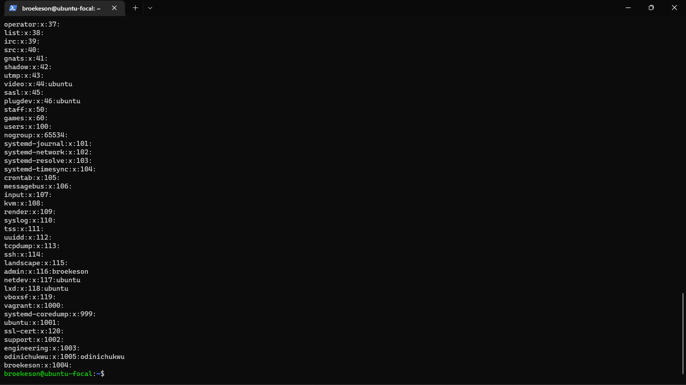
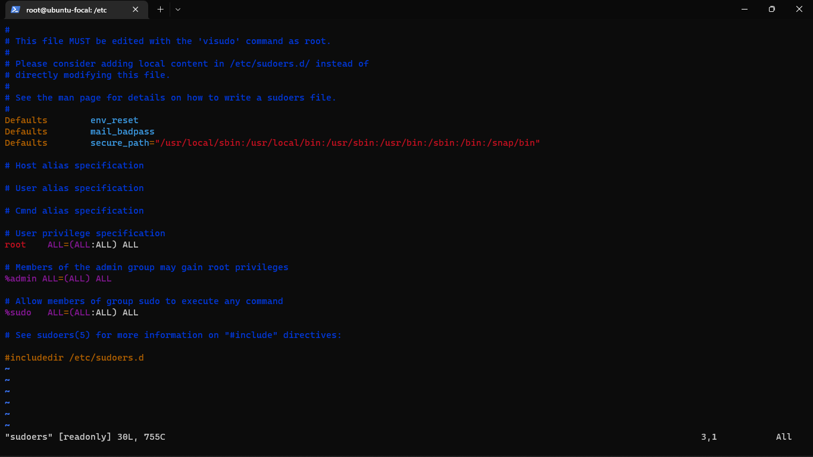

Exercise: 3

Create 3 groups – admin, support & engineering and add the admin group to sudoers. 
Create a user in each of the groups. 
Generate SSH keys for the user in the admin group

Instruction:

Submit the contents of /etc/passwd, /etc/group, /etc/sudoers

Solution:
  - Create the groups using the command "sudo groupadd admin", "sudo groupadd support" and "sudo groupadd engineering".
  - Create the users using the command "sudo useradd -m -G admin,engineering -s /bin/bash broekeson", "sudo useradd -m -G support -s /bin/bash godwin" and "sudo useradd -m -G engineering -s /bin/bash user3".
  - Add the user "broekeson" to the sudoers using the command "sudo usermod -aG sudo broekeson".
  - Generate the SSH keys for the user "broekeson" using the command "ssh-keygen" and follow the instructions.

  1. The contents of /etc/passwd are:
  

  2. The contents of /etc/group are:
  

  3. The contents of /etc/sudoers are:
  
