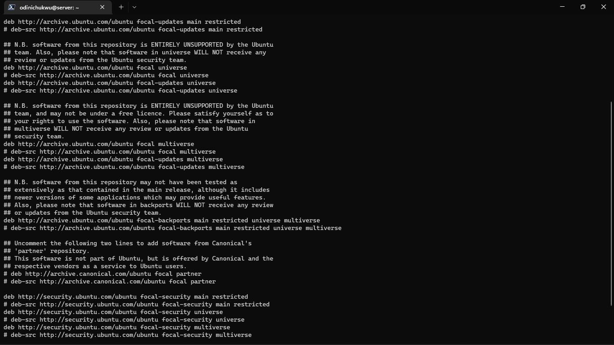
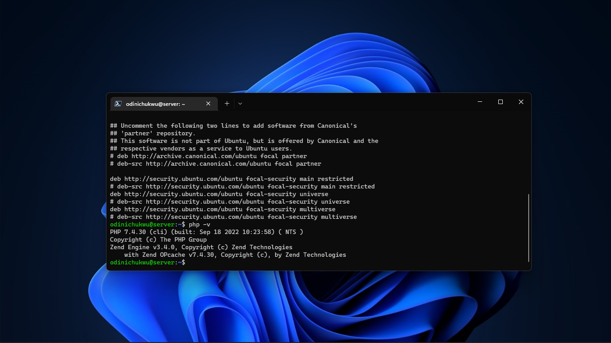

Exercise 4

Task:

Install PHP 7.4 on your local linux machine using the ppa:ondrej/php package repo.
Instruction:

Learn how to use the add-apt-repository command
Submit the content of /etc/apt/sources.list and the output of php -v command.

Solution:
  - Get the latest version of PHP 7.4 repo using the command "sudo add-apt-repository ppa:ondrej/php"
  - Update the package list using the command "sudo apt-get update"
  - Install PHP 7.4 using the command "sudo apt-get install php7.4" and its dependencies.
  - Use php -v to check the version of PHP installed.

  1. The contents of /etc/apt/sources.list are:

  2. The output of php -v is:

