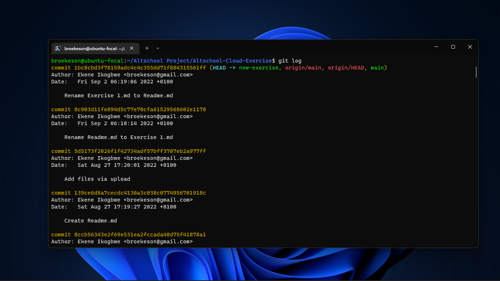

Exercise 6

Task:

You already have Github account, also setup a GitLab account if you don’t have one already
You already have a altschool-cloud-exercises project, clone the project to your local system
Setup your name and email in Git’s global config
Instruction:

Submit the output of:
git config -l
git remote -v
git log

Solution:

- The output of git config -l is:

- The output of git remote -v is:

- The output of git log is:

