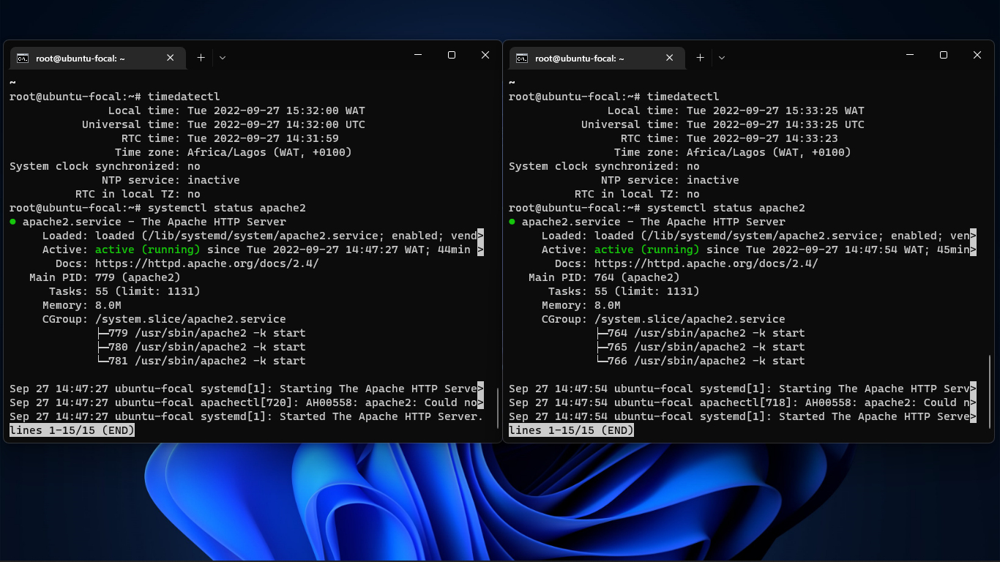
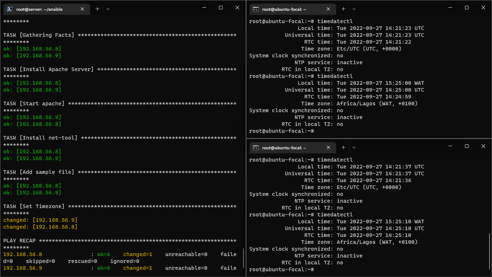
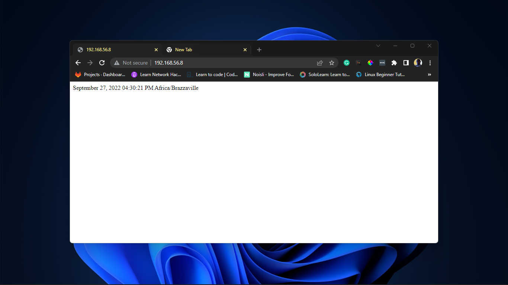

Exercise 9

Task:
Create an Ansible Playbook to setup a server with Apache
The server should be set to the Africa/Lagos Timezone
Host an index.php file with the following content, as the main file on the server:

```
<?php
date("F d, Y h:i:s A e", time());
?>
```

Instruction:
Submit the Ansible playbook, the output of systemctl status apache2 after deploying the playbook and a screenshot of the rendered page

Solution:

- Install Ansible on your local system
- SSH into the node
- Create hosts file with node IP
- Create playbook.yml file with the following content:

coontent of test.yml

```
---
- name: Setup Web Server
  hosts: all
  remote_user: root

  tasks:
  - name: Install Apache Server
    apt:
     name: apache2
     state: present
 
  - name: Start apache
    service:
     name: apache2
     state: started 

  - name: Install net-tool
    apt:
     name: net-tools
     state: present

  - name: Install PHP
    apt:
     name: libapache2-mod-php
     state: present

  - name: Add sample file
    copy:
     content: <?php echo date("F d, Y h:i:s A e", time()); ?>
     dest: /var/www/html/index.php

  - name: Set Timezone
    command: "timedatectl set-timezone Africa/Lagos"

  - name: Remove index.html
    file:
     path: /var/www/html/index.html
     state: absent
```
The output of systemctl status apache2 after deploying the playbook is:



A screenshot of the timedaatectl



A screenshot of the rendered page is:


